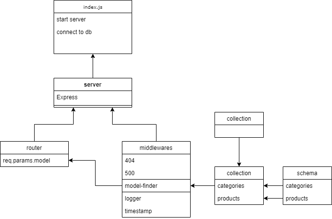

# LAB - Class 09:Modularity

## Project: api-server Phase:4

### Author: Dina Alsaid

### Links and Resources

- [swagger hub documentation](https://app.swaggerhub.com/apis/dinaAlsaid/default-title1/0.1)

### Setup

- .env variables
`PORT=3000`
`MONGODB_URI=mongodb://localhost:27017/store`

#### How to initialize/run your application

- `json-server --id=_id --watch ./data/db.json`
- start: `node index.js`
- test: `jest --coverage --verbose`

#### How to use your library (where applicable)

#### Tests

#### UML

